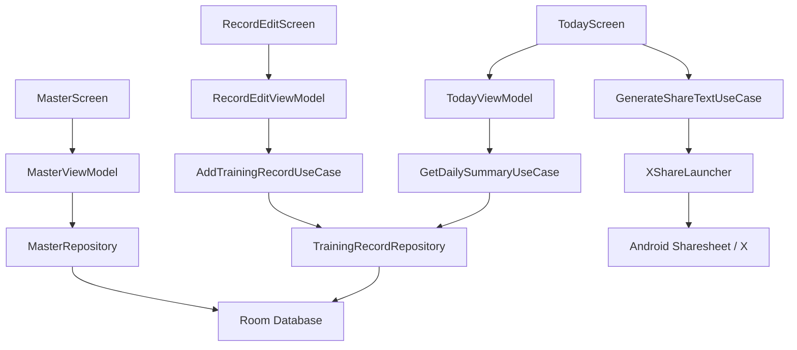

# Requirements


# 筋トレ回数記録 Android アプリ MVP 仕様書

## 概要・ゴール

筋トレ種目ごとの**日次合計回数**を手軽に記録できる Android アプリを作る。UI は「あすけん」のような健康記録アプリらしい、明るく親しみやすいカード型・日次ダッシュボード型の体験を目指す。ただし、既存サービスの画面・名称・キャラクター・ブランド資産はコピーせず、雰囲気のみ参考にする。

## 前提

- プロジェクトルート `/Users/t45k/prog/askin` にはアプリ実装ファイルがまだ存在しない。
- 初版は MVP とし、以下を優先する。
  - 筋トレ回数の記録
  - 種目マスタ管理
  - カテゴリ管理
  - 初期マスタ投入
  - X 共有
- 記録粒度はユーザー回答に基づき、**セット単位ではなく日次合計回数**とする。
- X 連携はユーザー回答に基づき、**Android 共有シートから X 投稿画面を開く方式**とする。

## スコープ

### In Scope

- Android アプリとして動作するローカル完結型 MVP。
- 筋トレカテゴリの作成・編集・削除。
- 筋トレ種目の作成・編集・削除。
- 自重トレーニング中心の初期マスタ登録。
- 日付ごと・種目ごとの合計回数記録。
- 今日の記録状況、日別合計、種目別記録を確認できる画面。
- 記録内容を X に共有する投稿文生成と Android 共有シート連携。

### Out of Scope

- セット単位の詳細記録。
- 重量、負荷、RPE、休憩時間、タイマー記録。
- X API OAuth 認証やアプリ内自動投稿。
- クラウド同期、ログイン、バックアップ。
- 食事記録、体重記録、栄養アドバイス。
- SNS フォロー、ランキング、フレンド機能。

## ユーザーストーリー

- 筋トレをしたユーザーとして、今日行った種目と回数をすぐ記録したい。
- 習慣化したいユーザーとして、今日の合計回数や履歴を見て達成感を得たい。
- 自分のメニューを管理したいユーザーとして、種目やカテゴリを自由に追加・編集したい。
- 記録を共有したいユーザーとして、今日の筋トレ結果を X に簡単に投稿したい。

## 機能要件

### 1. ホーム / 今日画面

- 起動時は今日の日付の記録画面を表示する。
- 今日の合計回数をカードで表示する。
- カテゴリ別または種目別の今日の記録一覧を表示する。
- 未記録時は「今日の筋トレを記録しましょう」のような空状態を表示する。
- 記録追加ボタンから、種目選択と回数入力へ遷移する。
- X 共有ボタンから今日の記録を共有できる。

### 2. 記録入力

- 日付、種目、回数を入力して保存する。
- 初期表示の日付は今日とする。
- 回数は 1 以上の整数のみ許可する。
- 同じ日付・同じ種目で既存記録がある場合、入力した回数を日次合計へ加算する。
- 記録後は今日画面へ戻り、合計回数と一覧を更新する。

### 3. 履歴画面

- 日付ごとの合計回数を一覧で確認できる。
- 任意の日付を開くと、その日の種目別回数を確認できる。
- 履歴から過去日の記録追加・修正ができる。
- MVP ではグラフは任意表示とし、最低限は日別リストでよい。

### 4. カテゴリマスタ管理

- カテゴリを追加・編集・削除できる。
- カテゴリ名は必須。
- カテゴリには表示順を持たせる。
- 初期カテゴリ例：
  - 腕
  - 胸
  - 腹筋
  - 背中
  - 下半身
  - 全身
- 過去記録に紐づくカテゴリや種目を削除する場合は、物理削除ではなく非表示化を基本とする。

### 5. 種目マスタ管理

- 種目を追加・編集・削除できる。
- 種目名、カテゴリ、表示順、有効/無効を管理する。
- 種目名は必須。
- 種目は必ず 1 つのカテゴリに所属する。
- 初期マスタは自重トレーニング中心とする。

#### 初期種目マスタ案

 カテゴリ | 種目例 |
---|---|
 腕 | 膝つき腕立て、ナロープッシュアップ、椅子ディップス |
 胸 | 腕立て伏せ、ワイドプッシュアップ、インクラインプッシュアップ |
 腹筋 | クランチ、レッグレイズ、バイシクルクランチ、シットアップ |
 背中 | バックエクステンション、リバーススノーエンジェル |
 下半身 | スクワット、ランジ、カーフレイズ、ヒップリフト |
 全身 | バーピー、マウンテンクライマー、ジャンピングジャック |

※ MVP は「回数」記録が前提のため、プランクのような秒数管理中心の種目は初期マスタから外すか、将来拡張候補とする。

### 6. X 共有

- 今日または選択日の記録を共有文として生成する。
- Android の `ACTION_SEND` 共有シートを使い、ユーザーが X を選んで投稿する。
- X API 認証、アクセストークン保存、自動投稿は行わない。
- 共有文例：

```text
今日の筋トレ記録 💪
合計 120 回
- 腕立て伏せ 30回
- スクワット 60回
- クランチ 30回
#筋トレ #自重トレ
```

## UI / UX 要件

- 全体は健康記録アプリらしい、明るくやさしい配色にする。
- カード、丸みのあるボタン、アイコン、余白を活用する。
- 今日の達成状況が一目で分かるダッシュボード構成にする。
- 下部ナビゲーションで主要画面へ移動できる。
  - 今日
  - 履歴
  - マスタ
  - 設定
- 空状態・保存完了・入力エラーは分かりやすく表示する。
- 片手操作しやすいよう、主要アクションは画面下部寄りに配置する。

## 非機能要件

- 初版はオフラインで完結する。
- 端末内データベースに永続化する。
- 日本語 UI を前提とする。
- データ量が増えても日別一覧・種目一覧が通常利用で遅くならないようにする。
- 削除によって過去記録が壊れないよう、マスタは論理削除を優先する。

# Technical Design


# 技術設計

## 現状

- `/Users/t45k/prog/askin` 配下に Android / Gradle / Kotlin / Java の実装ファイルは見つからない。
- 既存コードの設計制約がないため、新規 Android アプリとして標準的な構成を採用する。

## 推奨アーキテクチャ

- 言語：Kotlin
- UI：Jetpack Compose
- 永続化：Room
- 画面遷移：Navigation Compose
- 状態管理：ViewModel + Kotlin Flow / StateFlow
- 構成：MVVM + Repository パターン

## キー方針

1. **ローカルファースト**
   - MVP はログイン・クラウド同期なしで完結させる。
   - Room にカテゴリ、種目、記録を保存する。

2. **日次合計モデル**
   - 記録は `date + exerciseId` 単位で 1 レコードに集約する。
   - 同日同種目の追加入力は `reps` に加算する。

3. **マスタは論理削除**
   - 過去記録の参照整合性を守るため、カテゴリ・種目には `isActive` を持たせる。
   - 削除操作は原則 `isActive = false` に更新する。

4. **X 連携は共有 Intent**
   - `Intent.ACTION_SEND` で投稿文を共有する。
   - API キー、OAuth、トークン管理は不要。

## データモデル案

```kotlin
data class Category(
    val id: Long,
    val name: String,
    val displayOrder: Int,
    val isActive: Boolean
)

data class Exercise(
    val id: Long,
    val categoryId: Long,
    val name: String,
    val displayOrder: Int,
    val isActive: Boolean
)

data class TrainingRecord(
    val id: Long,
    val date: LocalDate,
    val exerciseId: Long,
    val reps: Int,
    val createdAt: Instant,
    val updatedAt: Instant
)
```

Room では `LocalDate` / `Instant` 用の TypeConverter を用意する。

## 主な画面構成

### TodayScreen

- 今日の日付、合計回数、種目別記録を表示する。
- 記録追加 FAB / ボタンを配置する。
- X 共有ボタンを表示する。

### RecordEditScreen

- 日付、カテゴリ、種目、回数を入力する。
- 保存時に同日同種目の既存記録があれば加算する。
- 入力エラーを画面内に表示する。

### HistoryScreen

- 日別の合計回数一覧を表示する。
- 日付選択で日別詳細を表示する。

### MasterScreen

- カテゴリ管理と種目管理への入口を持つ。
- カテゴリ別に種目を一覧表示する。

### CategoryEditScreen / ExerciseEditScreen

- マスタの追加・編集・非表示化を行う。

### SettingsScreen

- アプリ情報、初期データ再投入の扱い、将来のデータエクスポート導線を置く余地を持たせる。
- MVP では最低限のアプリ情報表示でもよい。

## 提案ファイル構成

```text
app/src/main/java/.../askin/
  MainActivity.kt
  AskinApp.kt
  data/
    local/
      AppDatabase.kt
      Converters.kt
      dao/
        CategoryDao.kt
        ExerciseDao.kt
        TrainingRecordDao.kt
      entity/
        CategoryEntity.kt
        ExerciseEntity.kt
        TrainingRecordEntity.kt
      seed/
        InitialMasterSeeder.kt
    repository/
      MasterRepository.kt
      TrainingRecordRepository.kt
  domain/
    model/
      Category.kt
      Exercise.kt
      TrainingRecord.kt
      DailyTrainingSummary.kt
    usecase/
      AddTrainingRecordUseCase.kt
      GetDailySummaryUseCase.kt
      GenerateShareTextUseCase.kt
  ui/
    common/
    today/
      TodayScreen.kt
      TodayViewModel.kt
    record/
      RecordEditScreen.kt
      RecordEditViewModel.kt
    history/
      HistoryScreen.kt
      HistoryViewModel.kt
    master/
      MasterScreen.kt
      MasterViewModel.kt
      CategoryEditScreen.kt
      ExerciseEditScreen.kt
    settings/
      SettingsScreen.kt
  share/
    XShareLauncher.kt
```

## 処理フロー



## 主要な実装ルール

- `TrainingRecord` は `date + exerciseId` にユニーク制約を付ける。
- 追加入力時は insert ではなく upsert / transaction で加算する。
- マスタ削除は `isActive=false` に更新する。
- 表示時は通常 `isActive=true` のマスタのみ出す。
- 過去記録詳細では、非表示化済み種目も記録名として参照できるようにする。
- 初期マスタ投入は初回起動時に一度だけ実行する。

## リスクと対策

- **あすけん風 UI の解釈差**：ブランドコピーではなく、健康記録アプリらしいカード UI・やさしい配色・日次サマリーとして定義する。
- **日次合計のみでは詳細分析が弱い**：MVP では割り切り、将来のセット記録拡張に備えてユースケース層を分ける。
- **マスタ削除で履歴が壊れる**：論理削除と参照整合性で防ぐ。
- **X アプリが未インストールの場合**：共有シート経由のため、ブラウザや他アプリにも共有可能にする。

# Testing


# 検証方針

## バリデーション観点

- 初期起動時にカテゴリ・種目マスタが投入されること。
- 今日の日付で回数を記録できること。
- 同じ日付・同じ種目に再度記録した場合、回数が加算されること。
- 日別合計と種目別回数が正しく表示されること。
- カテゴリ・種目の追加、編集、非表示化ができること。
- 非表示化した種目が新規入力候補から消え、過去記録では参照できること。
- X 共有文が日別記録から正しく生成されること。
- Android 共有シートが開くこと。

## テスト対象

- Repository / UseCase の単体テスト。
- Room DAO の永続化テスト。
- ViewModel の状態更新テスト。
- Compose UI の主要画面表示テスト。

## 主要シナリオ

1. 初回起動
   - 初期カテゴリと初期種目が表示される。
2. 今日の記録追加
   - 腕立て伏せ 30 回を記録すると、今日の合計が 30 回になる。
3. 同日同種目への追加入力
   - 腕立て伏せ 20 回を追加すると、今日の腕立て伏せが 50 回になる。
4. 履歴確認
   - 記録済みの日付が履歴に表示され、詳細で種目別回数が確認できる。
5. X 共有
   - 合計回数と種目別回数を含む共有文が生成される。

## エッジケース

- 回数が 0、負数、未入力の場合は保存できない。
- 種目未選択では保存できない。
- カテゴリ名・種目名が空では保存できない。
- マスタを非表示化しても過去記録の表示が壊れない。
- X がインストールされていなくても共有シート経由で共有先を選べる。

# Delivery Steps

### ✓ Step 1: Androidアプリ基盤とローカルデータモデルを実装
Android MVP の土台として、Compose + Room のアプリ基盤と日次合計記録モデルが動作する状態にする。

- 新規 Android アプリ構成を作成し、Kotlin / Jetpack Compose / Navigation Compose / Room を導入する。
- `CategoryEntity`、`ExerciseEntity`、`TrainingRecordEntity` と DAO を実装する。
- `date + exerciseId` の日次合計記録を扱うユニーク制約と加算保存処理を用意する。
- 自重トレーニング中心の初期カテゴリ・初期種目を投入する `InitialMasterSeeder` を実装する。
- DAO / Repository の基本テストで初期投入と記録保存を検証する。

### ✓ Step 2: マスタ管理機能を実装
カテゴリと筋トレ種目をアプリ内で追加・編集・非表示化できる状態にする。

- `MasterScreen` でカテゴリ別の種目一覧を表示する。
- `CategoryEditScreen` でカテゴリ名と表示順を登録・編集できるようにする。
- `ExerciseEditScreen` で種目名、所属カテゴリ、表示順を登録・編集できるようにする。
- 削除操作は物理削除ではなく `isActive=false` の論理削除として実装する。
- ViewModel テストで追加・編集・非表示化後の一覧更新を検証する。

### ✓ Step 3: 日次記録・ホーム・履歴機能を実装
ユーザーが種目ごとの日次合計回数を記録し、今日画面と履歴画面で確認できる状態にする。

- `TodayScreen` に今日の合計回数、種目別回数、記録追加導線を実装する。
- `RecordEditScreen` に日付、種目、回数入力フォームを実装する。
- 同日同種目の追加入力時に既存レコードへ回数を加算するユースケースを実装する。
- `HistoryScreen` に日別合計一覧と日別詳細表示を実装する。
- 入力値エラー、未記録時の空状態、過去日編集の主要シナリオをテストする。

### ✓ Step 4: X共有とMVP向けUI仕上げを実装
日別筋トレ記録を共有文に変換し、Android 共有シートから X へ共有できる状態にする。

- `GenerateShareTextUseCase` で日別合計と種目別回数を含む共有文を生成する。
- `XShareLauncher` で `Intent.ACTION_SEND` による Android 共有シート連携を実装する。
- 今日画面と履歴詳細から共有アクションを実行できるようにする。
- あすけん風の健康記録アプリらしいカード UI、配色、余白、空状態表示を整える。
- X 未インストール時も共有シートが開くことと、共有文の内容を検証する。